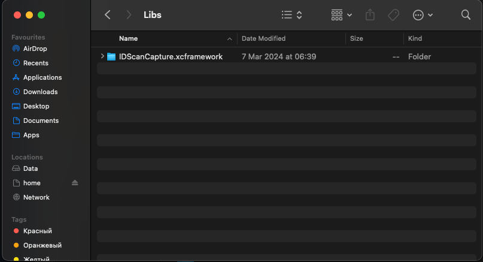
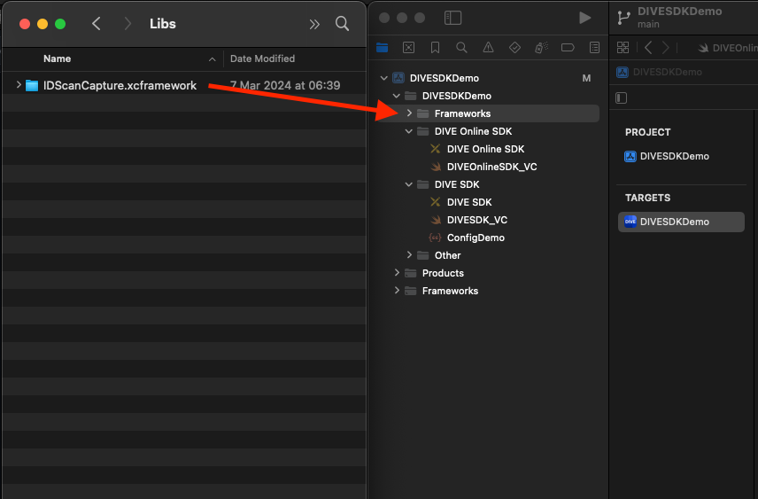
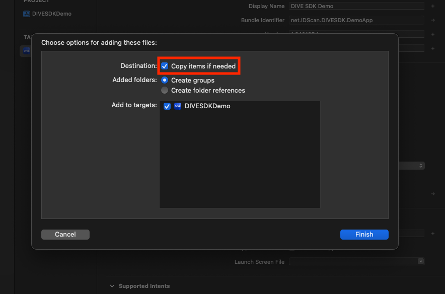
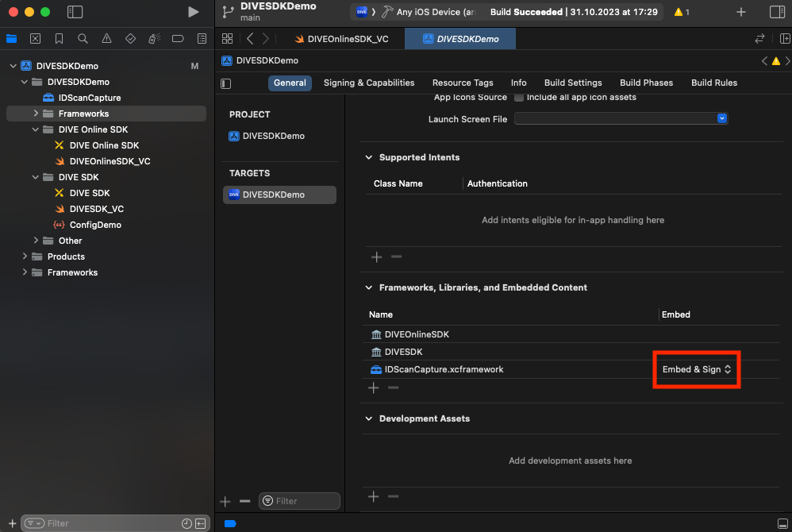

# DIVE iOS SDK

To install **DIVE iOS SDK** as a `Swift Package`, please [read here](../../../#installation)

---

## Installing as XCFramework (relevant for both Swift and Objective-C projects)

1. [Download](../../../archive/master.zip) and unzip the archive with **DIVE iOS SDK**.

---

1. Open unzipped directory. Then open `Libs` folder in it. `IDScanCapture.xcframework` 

---

3. Add frameworks you need to your project dragging them into the `Project navigator`.

---

4. Keep checkbox `Copy items if needed` checked, select needed targets and push the `Finish` button.

---

5. Go to `your target` → `General`, scroll down to `Frameworks, Libraries, and Embedded Content` section. Be sure, that the frameworks appeared there, otherwise add them with `+` button. Change `Embed` mode from `Do Not Embed` to `Embed & Sign`. Repeat this for all targets you selected in `step 4`.
   

---

## Request a DIVE Online Username and Password from IDScan.net

Email [support@idscan.net](mailto:support@idscan.net) for a DIVE Online Username and Password